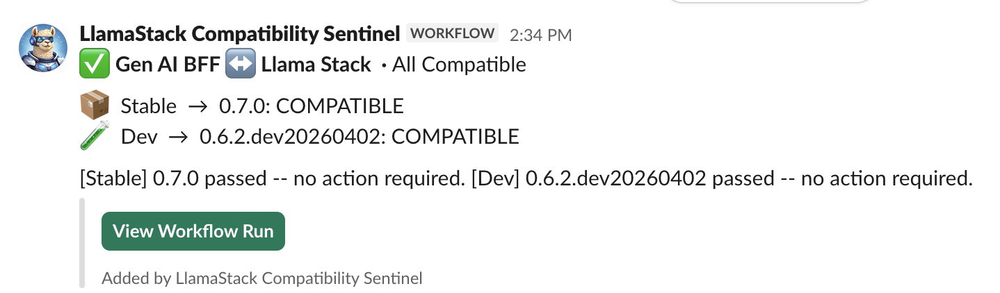
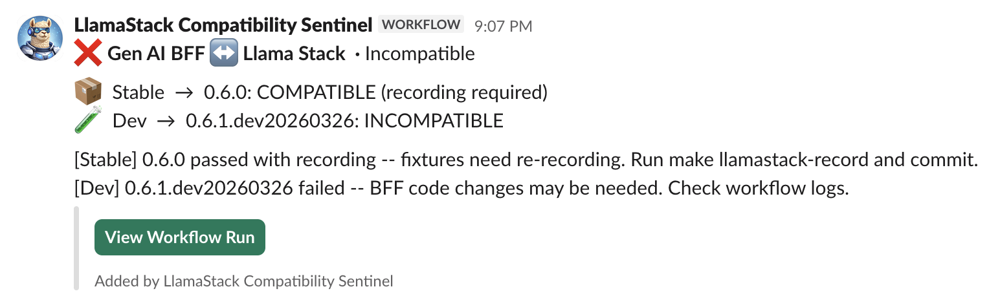

How do you keep your backend compatible with an upstream dependency that changes its API every week? And how do you do it without spending a dollar on large language model (LLM) calls?

That was our problem, where our Go backend integrates with [Llama Stack](https://github.com/meta-llama/llama-stack). We replaced our mocked unit tests with a real Llama Stack server, used its built-in record-replay to avoid LLM costs and wired a daily Slack sentinel that notifies us before our users do.

## The problem: Our mocks were lying to us

Our Go test suite for the backend for frontend (BFF) used mocked Llama Stack APIs. Standard practice: define the expected request and response shapes, assert against them and move on.

The problem was that Llama Stack was iterating fast, really fast. In early 2026, the upstream project released multiple times a week, adding new API fields, changing response shapes, and deprecating endpoints. Every time they changed something, our mocked tests kept passing, green checkmarks everywhere. And then someone would deploy, and the BFF would break against the real server.

Mocks test your assumptions about an API. When the API changes underneath you, the mocks don't update themselves. You end up with a test suite that gives you confidence about a contract that no longer exists. We needed to test against the real thing.

## The first decision: Start a real server

The idea to use a real Llama Stack instead of mocks came from our architect. The BFF already had a pattern for this. When you run `make test`, the test suite automatically starts a local MLflow server as a child process, seeds it with test data, runs tests against it, and tears it down.

Could we do the same for Llama Stack? Yes, but the implementation details mattered. I took the idea and ran with it.

### Docker or subprocess?

The obvious approach was Docker. Llama Stack publishes container images. Spin one up, run tests, and tear it down.

I went in a different direction, using the `uv run` command as a subprocess.

The `uv` command is a fast Python package manager. With a single command, it installs a specific version of Llama Stack from PyPI and starts it inside the same terminal session as the BFF. No Docker daemon. No image pulls. No container networking. The Llama Stack process runs on `127.0.0.1:18321`. The Go test suite connects to it directly and gets a `SIGTERM` when tests finish the process group.

```
// Simplified — full version in lsmocks/llamastack_process.go
cmd := exec.CommandContext(ctx, uvBin,
    "run",
    "--with", "llama-stack=="+version,
    "--with", "llama-stack-api=="+version,
    "--with-requirements", requirementsPath,
    "llama", "stack", "run", configPath,
    "--port", fmt.Sprintf("%d", port),
)
```

When you run `make test`, it calls `go test ./…`, which enters the Ginkgo `BeforeSuite in api_suite_test.go`. That's where `SetupLlamaStack` starts the child process, waits up to 180 seconds for a health check on `/v1/models` and seeds the server with test data. If a Llama Stack is already running on the target port (from a previous dev session), it reuses that instance with a warning about potentially stale database state.

This meant any developer could run `make test` and get a full integration test against a real Llama Stack server with no Docker, no special setup, and no cluster. The version was pinned in the Makefile, so updating it was a one-line change.

## The second problem: LLMs cost money

Here's where it got tricky. A real Llama Stack server needs a real inference provider. When the BFF calls the responses API, Llama Stack forwards that to an LLM (e.g., Gemini), gets back generated text, and returns it to the BFF. The same is true for embeddings when testing vector stores and for safety when testing guardrails.

If every `make test` run hit a frontier model, we'd burn through API credits fast. In continuous integration (CI) where tests run on every pull request, the cost would be unsustainable. Not to mention, the LLM responses are non-deterministic. The same prompt doesn't give the same answer twice. That's a bad property for a test suite.

We needed a way to get real Llama Stack behavior without real LLM calls on every run.

## The eureka moment: The record-replay system

I went digging through the upstream Llama Stack codebase, looking for anything that could help. I found a built-in record-replay system for testing.

The mechanism is straightforward. Llama Stack intercepts every request sent to the inference provider (Gemini in our case). It can operate in two modes:

- **Record mode**: Llama Stack makes the real API call to Gemini, gets the response, returns it to the caller, and saves the request and response as a JSON fixture. A hash of the request parameters keys each fixture.
- **Replay mode**: Llama Stack looks up the request hash in its fixture directory. If a matching fixture exists, it returns the recorded response without ever calling Gemini. If not, the test fails, telling you that your test is making a call that hasn't been recorded yet.

The recorded fixtures look like this:

```
{
  "test_id": "bff/testdata/llamastack/test.py::record",
  "request": {
    "method": "POST",
    "url": "https://generativelanguage.googleapis.com/v1beta/openai/v1/embeddings",
    "body": {
      "model": "models/gemini-embedding-001",
      "input": ["Artificial intelligence (AI) is the simulation of..."],
      "encoding_format": "float",
      "dimensions": 128
    }
  },
  "response": {
    "body": {
      "data": [{"embedding": [0.002, -0.001, ...], "index": null}],
      "model": "models/gemini-embedding-001"
    }
  }
}
```

Note: I set the embedding dimension to 128 instead of the default 768. You’ll commit these fixtures to Git. At 768 dimensions with multiple embeddings per test, the JSON files would bloat the repository. At 128, each fixture is a few kilobytes. Our tests don't care about embedding quality. They care that the BFF correctly handles the response shape.

## Wiring it together

The implementation required three pieces working in concert.

### 1. Test ID correlation

Llama Stack's record-replay system uses a test ID to isolate recordings. Every HTTP request the BFF sends to Llama Stack needs to carry an `X-LlamaStack-Provider-Data` header containing a `__test_id field`. This header flows through to the inference provider layer, where the record-replay system uses it to match requests to fixtures.

I built a custom Go HTTP transport (`testIDHeaderTransport`) that wraps every outbound request and injects the `X-LlamaStack-Provider-Data` header with a `__test_id field`. The tricky part is merging. The BFF already sends this header for some operations (provider-specific data like API keys), so the transport needs to add the test ID alongside existing data rather than overwriting it.

### 2. A dual-mode client factory

Not every test run needs a real Llama Stack server. Cypress end-to-end tests, local development and some CI jobs can use a simple in-memory mock.

The `MockClientFactory` auto-detects the environment:

```
func (f *MockClientFactory) CreateClient(...) LlamaStackClientInterface {
    if client := TryCreateTestClient(); client != nil {
        return client  // Real Llama Stack server available
    }
    return NewMockLlamaStackClient()  // Fallback to in-memory mock
}
```

If you set `TEST_LLAMA_STACK_PORT` (which `make test` does), you’ll get a real client connected to the local server. If not, you’ll get the mock. The developer provides one factory, two modes, and zero configuration.

### 3. Data seeding

A bare Llama Stack server has no vector stores, files, or embeddings. The `SeedData` function runs after the server is healthy. It verifies available models, creates a test vector store, uploads a sample document, waits for the embedding to complete (Llama Stack processes embeddings asynchronously), and returns the IDs that tests reference.

The polling on embedding completion is important. Without it, you get a race condition where tests that do `file_search` find zero chunks because the index isn't ready. The wait loop checks every 500ms with a 60-second timeout.

## How the team runs it daily

With the test infrastructure in place, our team’s daily workflow involves several key processes. For local development (which is most common), running `make test` starts Llama Stack in replay mode using committed fixtures at no cost, taking about 2 minutes. When you change a BFF API, running `GEMINI_API_KEY=<key> make llamastack-record` clears existing recordings and runs all tests in record mode against real Gemini to capture and commit new fixtures, which typically occurs once or twice a sprint. Finally, in PR CI, the process is the same as local development, using replay mode and committed fixtures without requiring an API key.

## The next level: The Compatibility Sentinel

Once the integration testing infrastructure was solid locally and in PR CI, I saw a bigger opportunity. We had the machinery to test any version of Llama Stack with a single variable change. Why not automate that?

Our Makefile pins Llama Stack to this specific version:

`TEST_LLAMA_STACK_VERSION ?= 0.7.2.dev20260423`

Change this one line, and the entire test suite runs against a different version.

I built a GitHub actions workflow in a separate repository (`odh-automations`) that runs every day at 06:30 UTC. It does three things:

**1. Resolves the latest versions from two sources:**

Stable: fetches `pypi.org/pypi/llama-stack/json` and reads `.info.version`

Dev: fetches `test.pypi.org/pypi/llama-stack/json`, filters releases containing "dev", sorts, takes the latest

Both run as parallel matrix jobs. For dev builds, the workflow pre-downloads wheels from `test.pypi.org` into a local directory and sets `UV_FIND_LINKS` so `uv` can resolve those pre-release packages reliably without depending on index ordering.

**2. Runs the BFF tests with a two-phase strategy:**

First, try replay mode. If the fixtures match, the version is compatible, and you don’t need LLM calls.

If replay fails (i.e., the new version changed something in the request/response format), try recording mode with a real Gemini key. If recording succeeds, the version is compatible, but the fixtures need refreshing.

If both fail, the version is genuinely incompatible, and you’ll need BFF code changes.

```
# Abbreviated — full workflow in gen-ai-bff-nightly.yml
# Also sets working-directory, continue-on-error, UV_FIND_LINKS for dev wheels,
# and a separate determine-result step that reads pinned vs tested versions.
- name: Run BFF tests (replay mode)
  id: replay-test
  continue-on-error: true
  run: TEST_LLAMA_STACK_VERSION=${{ steps.resolve-version.outputs.version }} make test

- name: Run BFF tests (recording mode)
  id: record-test
  if: steps.replay-test.outcome == 'failure'
  env:
    GEMINI_API_KEY: ${{ secrets.GEMINI_API_KEY }}
  run: TEST_LLAMA_STACK_VERSION=${{ steps.resolve-version.outputs.version }} make llamastack-record
```

This two-phase approach was the key design insight. Most days, stable and dev pass on replay, making zero LLM calls. Gemini only gets calls when something actually changes. We're talking maybe a few cents per week in API costs for the entire team.

**3. Sends structured results to Slack via Workflow Builder:**

The notification script computes an overall status and sends a JSON payload to a Slack Workflow Builder webhook. We chose Workflow Builder over a custom Slack app because it's simpler to set up and doesn't require app approval from the workspace admins. Figure 1 shows what the team sees in their Slack channel every morning.



*Figure 1: This is the workflow with successful verification.*

Figure 2 shows the Slack message when things break.



*Figure 2: This is the workflow with failed verification.*

We named it LlamaStack Compatibility Sentinel. Every day, it tells us exactly where we stand.

## What the Sentinel caught in practice

The Sentinel has been running since March 2026. Here's what actually happened:

**March 18**: First alert: Stable LLS 0.6.0 was compatible with recording required, meaning response shapes drifted; but the API contract held. Dev 0.6.1 was incompatible. This gave us weeks of lead time before those breaking changes hit stable.

**Late March**: The Llama Stack team announced v1.0.0 with major architectural changes, including the removal of inline providers and new `file_processors` API requirements. Already, our Sentinel had been flagging dev build failures daily, so we knew exactly which changes would affect us.

**April 9**: It was all green, stable 0.7.1 compatible, and dev 0.7.1.dev20260409 compatible, providing a brief window of peace.

**April 10 onward**: Dev builds started failing consistently. The `0.7.2.dev` series introduced changes that broke our BFF. We could see it coming, so we tracked the regression daily and prepared our upgrade path as a team. Without the Sentinel, we would have discovered this when someone tried to upgrade in production.

I used this data directly in sprint planning. I wrote to the team: "Our nightly compatibility workflow has already flagged a dev version of LLS that breaks the BFF. Once those breaking changes land in a stable release, we'll need to start the upgrade in earnest.” This wasn't a guess. The Sentinel had been telling us for two weeks.

## Our suggestions

Test against the real dependency, not a simulation of it. Mocks test your assumptions. Integration tests against a real server test reality. The gap between the two is where production bugs hide.

Use record-replay, not just mocks. If your dependency has a record-replay system (or you can build one), use it. You get the fidelity of real integration tests with the speed and cost of mocks. The Llama Stack team built this into their test infrastructure. Leveraging it for our Go BFF was the single best decision I made on this project.

Automate the version matrix. All you need is a Makefile variable and a CI job that swaps it. Test against stable (what your users have) and dev (what's coming). The delta between the two is your early warning system.

Make the results visible. A test that runs in CI and nobody looks at is a test that doesn't exist. Slack notifications with clear status (e.g., compatible, needs recording, or incompatible) turn a background CI job into a daily team signal.

Keep fixtures small. If you're committing LLM response fixtures to Git, think about size. Choose 128-dimension embeddings instead of 768. Use short sample documents. Every kilobyte multiplied by every fixture multiplied by every clone adds up.

## How to adapt this for your project

This pattern works for any backend that integrates with a fast-moving upstream dependency, not just Llama Stack. If your project consumes a Python server, an API that releases frequently, or any dependency whose contract changes between versions, the same approach applies.

Here is what you need:

- **Subprocess lifecycle management**: A module that starts the upstream server as a child process waits for a health check and tears it down after tests complete.
- **Test data and fixtures**: A config file for the upstream server, pinned dependency versions, and committed record-replay fixtures (JSON recordings of real API responses).
- **Makefile targets**: `test` (replay mode), `record` (re-record fixtures against the real dependency), and `up / down` (manual server lifecycle for local development)
- **CI workflow**: A scheduled job that resolves the latest stable and dev versions, runs the two-phase test strategy (replay first and record if needed), and reports results.
- **Notifications**: A Slack webhook (or equivalent) that surfaces daily compatibility status to the team.

Any backend that depends on Llama Stack (or any rapidly evolving upstream project) faces the same version-drift problem. We designed this infrastructure to be portable.

It took me about three weeks to build the entire system, from `make test` starting a local Llama Stack server to the Slack Sentinel reporting compatibility every morning. The ongoing cost is effectively zero. A few minutes of GitHub Actions compute per day, and the occasional Gemini API call when fixtures need refreshing.

It's been running daily since March. So far, daily runs have caught every breaking change in upstream dev builds before they reached stable, giving us weeks of lead time on each. When Llama Stack v1.0.0 announced breaking changes, we already had a clear picture of which ones affected us because the Sentinel had been flagging them for two weeks.

That's the whole point, not perfection, but early visibility. The kind of visibility that turns a production outage into a planned sprint task for the team.

## Learn more

You can find the [test infrastructure](https://github.com/opendatahub-io/odh-dashboard) under `packages/gen-ai/bff/`. Review the [Llama-stack](https://github.com/llamastack/llama-stack) upstream project, including the record-replay system.
